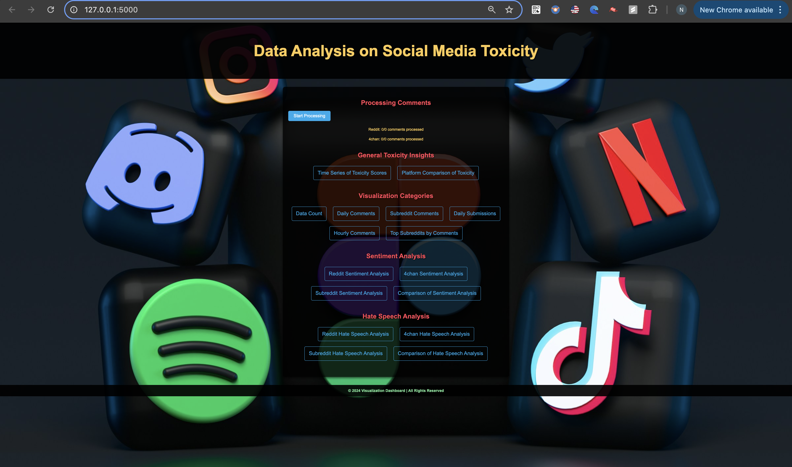

Here's a draft for your README file:

---

# Sentiment Analysis and Data Visualization for Reddit and 4chan

This Flask-based application provides insights and visualizations on Reddit and 4chan comments, including sentiment analysis, hate speech detection, and various metrics such as daily comments, submissions, and toxicity levels.

## Features

- **Data Collection and Processing**:
  - Continuous collection of Reddit and 4chan data using SQL databases.
  - Sentiment classification (Positive, Neutral, Negative) using `TextBlob`.
  - Hate speech detection and toxicity score computation.

- **Visualization**:
  - Grouped bar charts for sentiment comparison across platforms.
  - Time series graphs for daily and hourly activity.
  - Top subreddits by number of comments.
  - Platform-wise comparison of toxicity levels.

- **Filters**:
  - Customizable date range filters for graphs and metrics.
  - Platform-based filtering for specific analyses.

## Tech Stack

- **Backend**:
  - Flask
  - SQLAlchemy
  - PostgreSQL for data storage and retrieval

- **Frontend**:
  - HTML Templates for rendering plots and graphs.
  - Matplotlib for data visualization.

- **Libraries Used**:
  - `pandas`: Data manipulation and processing.
  - `TextBlob`: Sentiment analysis.
  - `nltk`: Natural Language Toolkit for text processing.
  - `matplotlib`: Visualization.

---

## Installation Guide

### Prerequisites

1. **Python 3.8+**: Ensure you have Python installed.
2. **PostgreSQL**: Set up PostgreSQL database and configure it.
3. **Virtual Environment**: Use `venv` or similar tools to create a virtual environment.

### Clone the Repository

```bash
git clone <repository-url>
cd <repository-folder>
```

### Create Virtual Environment and Install Dependencies

```bash
python3 -m venv env
source env/bin/activate  # On Windows: env\Scripts\activate
pip install -r requirements.txt
```

### Database Configuration

1. Set up the following PostgreSQL databases:
   - **Reddit**: `reddit_data_crawler`
   - **4chan**: `chan_data_crawler`

2. Create tables for storing comments and posts:
   - For Reddit: `reddit_crawler_comments` and `reddit_crawler_posts`
   - For 4chan: `chan_comments` and `chan_posts`
3. port for both is 5437
4. Update database credentials in the script:
   ```python
   reddit_db_url = "postgresql://<username>:<password>@<host>:<port>/reddit_data_crawler"
   chan_db_url = "postgresql://<username>:<password>@<host>:<port>/chan_data_crawler"
   ```

### Run the Application

```bash
python app.py
```

The application will start at `http://127.0.0.1:5000/`.

---

## Usage

### Endpoints

#### 1. **Homepage**
   - URL: `/`
   - Lists all available visualizations and analyses.

#### 2. **Sentiment Comparison**
   - URL: `/sentiment-comparison`
   - Displays a grouped bar chart comparing sentiment counts across platforms.

#### 3. **Daily Comments**
   - URL: `/daily-comments`
   - Visualizes daily comment counts for Reddit and 4chan.

#### 4. **Top Subreddits**
   - URL: `/top-subreddits`
   - Displays the top 10 subreddits by number of comments.

#### 5. **Toxicity Levels**
   - URL: `/platform-comparison-toxicity`
   - Compares average toxicity levels across platforms.

#### 6. **Subreddit-Specific Comments**
   - URL: `/subreddit-comments`
   - Line graph showing daily comment counts for a specific subreddit.

---

## Example Outputs

### 1. Sentiment Comparison
A grouped bar chart showing Positive, Neutral, and Negative sentiment counts for Reddit and 4chan.

### 2. Time Series Graphs
Daily and hourly trends in comment and submission activity.

### 3. Toxicity Comparison
Average toxicity scores compared between Reddit and 4chan.

## Web Interface

Here is a preview of the web interface:




